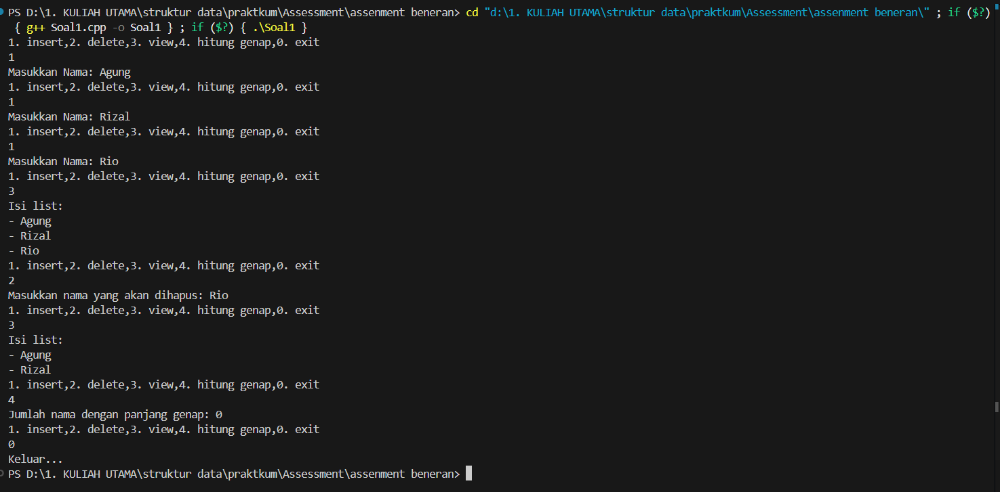

Assessment 1 - Struktur Data]

Identitas Pengumpul

Nama: Fa'iq Jagadhita Hardiana

NIM: 103112430015

Kelas: IF-12-05

1. Kode Program

Berikut adalah kode program untuk program ini buat ngisi nama orang dan hapus serta view dan cari nama genap .

(Silakan ganti bahasa dan kode di bawah ini sesuai tugas Anda)

```cpp
  //* Author: [Fa'iq Jagadhita Hardiana]
 //* NIM: [103112430015]
 // nim ganjil soal nomer 1
 

#include <iostream>
using namespace std;

struct Node {
    string nama;
    Node* next;
};

Node* head = NULL; 


void insertAkhir (string nama) {
    Node* baru = new Node;
    baru->nama = nama ;
    baru->next = NULL;

    if (head == NULL) {
        head = baru;
        return;
    }

    Node* temp = head;
    while (temp->next != NULL) {
        temp = temp->next;
    }

    temp->next = baru;
}

void deleteNamaCari() {
    if (head == NULL) {
        cout << "List kosong. Tidak ada yang dihapus.\n";
        return;
    }

    string namaCari;
    cout << "Masukkan nama yang akan dihapus: ";
    cin >> namaCari;

    Node* temp = head;
    Node* prev = NULL;

    while (temp != NULL && temp->nama != namaCari) {
        prev = temp;
        temp = temp->next;
    }

 
    if (temp == NULL) {
        cout << "Nama tidak ditemukan dalam list.\n";
        return;
    }

    if (prev == NULL) {
        head = head->next;
    } else {
        prev->next = temp->next;
    }

    delete temp; 
    
    
}

void viewList() {
    if (head == NULL) {
        cout << "List kosong.\n";
        return;
    }

    Node* temp = head;
    cout << "Isi list:\n";
    while (temp != NULL) {
        cout << "- " << temp->nama << endl;
        temp = temp->next;
    } 
}

void hitungGenap() {
    if (head == NULL) {
        cout << "List kosong.\n";
        return;
    }

    int count = 0;
    Node* temp = head;

    while (temp != NULL) {
        if (temp->nama.length() % 2 == 0) {
            count++;
        }
        temp = temp->next;
    }

    cout << "Jumlah nama dengan panjang genap: " << count << endl;
}


int main () {
    int pilihan, posisi;
    string nama;

    do {
        //menu 
        cout << "1. insert," << "2. delete," << "3. view," << "4. hitung genap," << "0. exit\n";
        cin >> pilihan;

        switch (pilihan){
        case 1:
            cout << "Masukkan Nama: ";
                cin >> nama;
                insertAkhir(nama);     
                break;
        case 2:
                deleteNamaCari();
                break;
        case 3:
            viewList();
            break;
        case 4:
            hitungGenap();
            break;
        case 0:
            cout << "Keluar...\n";
            break;

        default:
            cout << "Pilihan tidak valid!\n";

        }

    } while (pilihan != 0);
    return 0;
}

```

2. Penjelasan Kode

Berikut adalah penjelasan alur logika dari kode program di atas:

Header & Namespace: Program mengimpor library iostream untuk operasi input/output (seperti cout dan cin) dan menggunakan std namespace.

Fungsi insertakhir():

buat ngisi nama orang din di akhir Node baru menjadi tail (next = null) 

Fungsi deletecarinama():

fungsi buat menghapus nama yg di inputkan user 

fungsi viewLIst ()

buat mencentak semua list nama 

fungsi  hitungGenap()

buat menghitung apakah nama dari orang itu benjumlah genap 


3. Output Program

Berikut adalah hasil eksekusi program (output) ketika dijalankan.



4. Penjelasan Lanjutan (Analisis Output)

dimana disini kita di suruh pilih opsi kita pilih 1 buat isi nama yaitu agung maka akan disimpan setelah itu masukan 1 dan isi nama lain kaya rizal rio 
terus pilih angka 3 buat cetak liist semua nama 
terus pilih angka 2 buat mengapus nama , setelah itu masukan namanya yang dihapus "rio"
terus cetak list nama lagi buat pastiin rionya hapus
terus pilih 4 buat nampilin jumlah nama genap 
dan exit 
5. Kesimpulan

Berdasarkan progam yang saya buat saya bisa menambah menghapus , melihat list dan meliaht nama genap dari single linklist ini tapi saya gk ada adt nya maap