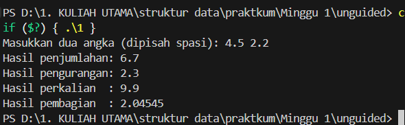

# Template Laporan Praktikum Struktur Data

## 1. Nama, NIM, Kelas
- **Nama**: Fa'iq Jagadhita Hardiana
- **NIM**: 103112430015
- **Kelas**: 12-IF-05

## 2. Motivasi Belajar Struktur Data
tentunya karena harus lulus stuktur data biar lulus, dan mungkin agak semangat dikit belajar bahasa baru yaitu c++ ya walaupun susah di cerna di saya lebih tepatnya butuh waktu ibaratnya loading wakk

## 3. Dasar Teori
stuktur data itu ibaratnya buat mengatur dan menyipan supaya bisa di cari, diproses, dan juga di ubah . Nah dari pemilihann stuktur data yang bagus dapat membuat program nya bisa berjalan lebih bagus , lebih efisien dll

- **Array**
	Array adalah struktur data linear yang menyimpan elemen dengan tipe data yang sama dalam blok memori yang berdekatan. Elemen dalam array diakses menggunakan indeks numerik.
- **Linked List**
	Linked List adalah struktur data linear di mana setiap elemen (disebut node) berisi data dan pointer yang menunjuk ke node berikutnya. Tidak seperti array, linked list tidak menyimpan elemen secara berurutan di memori.
- **Stack**  
    Stack (tumpukan) adalah struktur data linear yang menerapkan prinsip **Last In, First Out (LIFO)**. Elemen terakhir yang ditambahkan akan menjadi yang pertama diambil.
- **Queue**  
    Queue (antrian) adalah struktur data linear yang menerapkan prinsip **First In, First Out (FIFO)**. Elemen pertama yang masuk akan menjadi yang pertama keluar.
- **Tree**  
    Tidak seperti array, linked list, stack dan queue, yang merupakan struktur data linier, tree adalah struktur data hierarkis. Binary tree adalah jenis struktur tree di mana setiap node memiliki paling banyak dua child, yang disebut sebagai left child dan right child. Binary tree seringkali diimplementasikan menggunakan link.
- **Graph**  
    Graph adalah struktur data yang terdiri dari kumpulan simpul berhingga untuk menyimpan data dan antara dua buah simpul terdapat hubungan saling keterkaitan. Graph merepresentasikan kumpulan object dimana pasangan dari objek terhubung oleh sebuah link.
## 4. Guided
### 4.1 Discount

```cpp
#include <iostream>

using namespace std;

int main () {
    double total_Pembelian, diskon;
    cout << "Berapa kamu belanja: Rp.";
    cin >> total_Pembelian;
    if (total_Pembelian >= 30000) {
        diskon = 0.1 * total_Pembelian;
        cout << "kamu dapat diskon sebesar " << diskon << "orang kaya koe sih ";
    } else {
        cout << "Koe be langka modal ko njauk diskon ";
    }
    return 0;
}
```

Output :


Penjelasan :
Program ini ngecek total belanja wak. Kalau belanja lebih dari atau sama dengan 30 ribu, nanti dapet diskon 10% . Tapi kalau belanjanya kurang dari itu, program bilang kita nggak dapet diskon karena “langka modal”.

### 4.2 For Loop

```cpp
#include <iostream>

using namespace std;

int main() {
    int jumlah;
    cout << "Tulis berapa banyak Perulangan: ";
    cin >> jumlah;
    for (int i = 0; i < jumlah; i++) {
        cout << "saya pintar sekali kaya pak yogi" << endl;
    }
    return 0;

}
```

Output :


Penjelasan :
Program ini  buat ngulang-ngulang tulisan. Pertama program bertanya  dulu, “Tulis berapa banyak Perulangan?”. Nah, angka yang masukin itu bakal jadi patokan berapa kali kalimat dicetak. Misalnya kamu masukin 3 , maka program bakal ngulang 3 kali tulisan begitu wak

### 4.3 Increment

```cpp
#include <iostream>

using namespace std;

int main() {
    int r = 20;
    int s;
    
    s = 20 + ++r;
    cout << "Nilai r saat ini" <<r<< endl;
    cout << "Nilai s saat ini" <<s<< endl;
    return 0;

}
```

Output :


Penjelasan :
Program ini memiliki variabel  interger dan nilai r = 20. Karena ada ++r, nilai r langsung naik jadi 21 sebelum dipakai, sehingga s = 20 + 21 = 41. Hasil akhirnya, r bernilai 21 dan s bernilai 41.

### 4.4 Konversi Suhu

```cpp
#include <iostream>

using namespace std;

int main() {
    float celcius, fahrenheit;
    cout << "tulis seberapa cool anda : ";
    cin >> celcius;
    fahrenheit = (9.0/5.0) * celcius + 32;
    cout << "suhu fahrenheit itu " << fahrenheit << "derajat" << endl;
    cout << "gila cool baget luu";
    return 0;

}
```

Output :


Penjelasan :
Program ini buat ngubah suhu dari Celcius ke Fahrenheit. Pengguna masukin suhu dalam Celcius, lalu program ngitung pake rumus (9/5)×celcius+32. Hasilnya ditampilin dalam Fahrenheit dan sedikit pesan 

## 5. Unguided
### 5.1 Unguided 1

```cpp
#include <iostream>

using namespace std;

int main() {
    double a, b;
    double tambah, kurang, kali, bagi;

    cout << "Masukkan dua angka (dipisah spasi): ";
    cin >> a >> b;

    tambah = a + b;
    kurang = a - b;
    kali   = a * b;
    bagi   = a / b;  

    cout << "Hasil penjumlahan: " << tambah << endl;
    cout << "Hasil pengurangan: " << kurang << endl;
    cout << "Hasil perkalian  : " << kali << endl;
    cout << "Hasil pembagian  : " << bagi << endl;

    return 0;
}

```

Output :


Penjelasan :
Program ini kayak kalkulator sederhana. Pengguna masukin dua angka desimal atau koma koma, lalu program langsung ngitung hasil penjumlahan(+), pengurangan(-), perkalian(), dan pembagian(/), terus ditampilin satu per satu. Semua operasi disimpan di variabel terpisah biar hasilnya nggak ketimpa.

### 5.2 Unguided 2

```cpp
#include <iostream>

using namespace std;

int main() {
    int angka;
    cout << "Masukkan angka (0-100): ";
    cin >> angka;

    if (angka < 0 || angka > 100) {
        cout << "Angka harus antara 0 sampai 100!" << endl;
    } else {
        cout << angka << " : ";

        if (angka == 0) cout << "nol";
        else if (angka == 100) cout << "seratus";
        else if (angka < 10) {
            string satuan[] = {"", "satu", "dua", "tiga", "empat", "lima",
                               "enam", "tujuh", "delapan", "sembilan"};
            cout << satuan[angka];
        }
        else if (angka < 20) {
            string belasan[] = {"sepuluh", "sebelas", "dua belas", "tiga belas",
                                "empat belas", "lima belas", "enam belas",
                                "tujuh belas", "delapan belas", "sembilan belas"};
            cout << belasan[angka - 10];
        }
        else {
            string satuan[] = {"", "satu", "dua", "tiga", "empat", "lima",
                               "enam", "tujuh", "delapan", "sembilan"};
            string puluhan[] = {"", "", "dua puluh", "tiga puluh", "empat puluh",
                                "lima puluh", "enam puluh", "tujuh puluh",
                                "delapan puluh", "sembilan puluh"};

            int puluh = angka / 10;
            int sisa = angka % 10;

            cout << puluhan[puluh];
            if (sisa != 0) {
                cout << " " << satuan[sisa];
            }
        }
    }

    cout << endl;
    return 0;
}

```

Output :


Penjelasan :
Program ini dipakai buat ngubah angka 0 sampai 100 menjadi bentuk tulisan. Pertama, program minta input angka dari user. Kalau angka yang dimasukkan kurang dari 0 atau lebih dari 100, program akan menampilkan pesan kalau angkanya tidak valid. Kalau valid, program baru bisa berjalan. Untuk angka seperti 0 akan ditulis “nol” dan 100 ditulis “seratus”. Kalau angkanya 1 sampai 9, program mengambil kata dari array satuan. Kalau angkanya 10 sampai 19, program mengambil dari array belasan yang sudah disiapkan. Sementara untuk angka 20 sampai 99, program memecah angka menjadi puluhan dan satuan, lalu menggabungkannya. Misalnya angka 79 akan dipecah jadi “tujuh puluh” dan “sembilan”, sehingga hasilnya “tujuh puluh sembilan”.

### 5.3 Unguided 3

```cpp
#include <iostream>

using namespace std;

int main() {
    int n;
    cout << "Input: ";
    cin >> n;

    for (int i = n; i >= 1; i--) {
        for (int s = 0; s < n - i; s++) {
            cout << "  ";
        }

        for (int j = i; j >= 1; j--) {
            cout << j << " ";
        }

        cout << "* ";

        for (int j = 1; j <= i; j++) {
            cout << j << " ";
        }

        cout << endl;
    }

    for (int s = 0; s < n; s++) {
        cout << "  ";
    }
    cout << "*" << endl;

    return 0;
}

```

Output :


Penjelasan :
Program ini dipakai buat bikin segitiga dari angka dan bintang di tengah. Pertama, program minta user masukin sebuah angka n sebagai tinggi segitiga. Lalu dengan perulangan, program membuat baris demi baris mulai dari angka terbesar sampai 1. Di tiap baris, program tambahin spasi di depan agar posisi bintang selalu lurus ke bawah. lalu , angka dicetak dari besar ke kecil di sisi kiri, lalu bintang, lalu angka naik di sisi kanan. Pola ini berlanjut sampai angka habis, dan di bagian paling bawah program mencetak satu bintang saja tepat sejajar dengan bintang-bintang di atasnya. Jadi hasil akhirnya berbentuk segitiga angka dengan bintang sebagai sumbu tengahnya .

## 6. Kesimpulan
aku bisa mengingat lagi program program seperti di alpro 1 dan 2  tapi dalam bahasa yang berbedaa (bikin pusing jadi ngelag dikit).

## 7. Referensi
1. https://dte.telkomuniversity.ac.id/struktur-data-dasar-array-linked-list-stack-dan-queue/
2. https://www.trivusi.web.id/2022/06/mengenal-struktur-data.html
