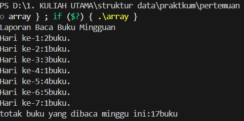
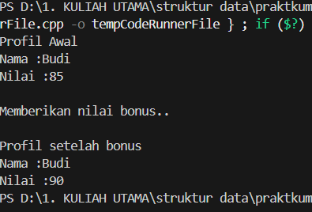
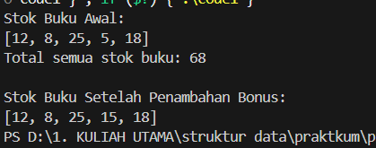

# Laporan Praktikum Struktur Data

## 1. Nama, NIM, Kelas
- **Nama**: Fa'iq Jagadhita Hardiana
- **NIM**: 103112430015
- **Kelas**: 12-IF-05

## 2. Motivasi Belajar Struktur Data
tentunya karena harus lulus stuktur data biar lulus, dan mungkin agak semangat dikit belajar bahasa baru yaitu c++ ya walaupun susah di cerna di saya lebih tepatnya butuh waktu ibaratnya loading wakk bissmillah BISA BROKKK

## 3. Dasar Teori
Array, pointer, dan function, kita perlu tahu dulu kalau tiga hal ini tuh sama-sama bagian penting dari cara kerja program biar bisa nyimpen data, ngatur memori, dan ngejalanin perintah dengan lebih rapih.

- **Array**: Array adalah struktur data yang digunakan untuk menyimpan beberapa nilai dengan tipe yang sama dalam satu variabel. Nilai-nilai ini tersusun secara berurutan dan bisa diakses menggunakan indeks. Indeks array dimulai dari angka 0, bukan 1. Jadi, elemen pertama ada di posisi ke-0, elemen kedua di posisi ke-1, dan seterusnya. Setiap nilai dalam array bisa diakses dengan menggunakan tanda kurung siku.
- **Pointer**: pointer adalah variabel yang menyimpan alamat memori dari suatu nilai atau objek. Ini memungkinkan kita untuk mengakses dan memanipulasi nilai atau objek tersebut dengan cara yang lebih efisien dan fleksibel.
- **Function**: Function (dalam bahasa Indonesia adalah Fungsi). Function adalah sebuah struktur, Pengelompokan yang mengandung sekelompok pernyataan yang akan dilaksanakan oleh CPU jika nama function tersebut dipanggil untuk dieksekusi, kecuali untuk function utama yaitu `int main()` yang akan dieksekusi secara otomatis.

## 4. Guided
### 4.1 Guided 1

```cpp
#include <iostream>

using namespace std;

int main() {
    int bukuPerHari[7]= {2,1,3,1,4,5,1};
    int totalBuku = 0;  

    cout << "Laporan Baca Buku Mingguan" << endl;

    for (int i = 0;i < 7; i++) {
        cout << "Hari ke-" << i + 1 <<":"<<bukuPerHari[i]
        <<"buku."<< endl;
        totalBuku += bukuPerHari[i];
    }
    cout << "totak buku yang dibaca minggu ini:" << totalBuku
    << "buku" << endl;
}
```

Output :



Penjelasan :
Program ini buat ngitung dan nampilin laporan berapa banyak buku yang dibaca selama seminggu. Di awal, ada array bukuPerHari 7 yang isinya jumlah buku yang dibaca dari hari pertama sampai hari ketujuh. Terus, ada variabel totalBuku buat nyimpen total buku yang dibaca selama seminggu. Nah, di dalam perulangan for, program bakal jalan dari hari ke-1 sampai ke-7, terus nampilin berapa buku yang dibaca tiap harinya, sambil terus nambahin jumlahnya ke totalBuku. Setelah semua hari selesai ditampilkan, program bakal ngeluarin total keseluruhan buku yang udah dibaca selama seminggu. Intinya, program ini kayak laporan mingguan buat ngitung total bacaan kamu, biar tau seberapa rajin kamu baca buku selama seminggu


### 4.2 Guided 2

```cpp
#include <iostream>

using namespace std;

int main () {
    float hargaProduk = 50000.0f;
    
    float* ptrHarga;
    ptrHarga = &hargaProduk;

    cout << "Harga Awal Produk : Rp" << hargaProduk <<endl;
    cout << "alamat memori harga:" << ptrHarga <<endl;

    cout << "\n..Memberikan diskon 20% melalui POinter..."<<endl;
    *ptrHarga = *ptrHarga * 0.8;
    cout << "Harga setelah diskon : Rp" << hargaProduk << endl;
    return 0;


}
```

Output:


Penjelasan :
Program ini buat nunjukin cara kerja pointer buat ngubah nilai variabel. Awalnya ada hargaProduk = 50000, lalu dibuat pointer ptrHarga yang nyimpen alamat memori dari variabel itu. Program nampilin harga awal dan alamatnya, lalu lewat baris *ptrHarga = *ptrHarga * 0.8;, pointer dipakai buat ngasih diskon 20%. Karena pointer langsung nyambung ke hargaProduk, nilainya ikut berubah jadi 40000. Jadi simpel aja, pointer di sini dipakai buat ngedit nilai variabel lewat alamat memorinya.

### 4.3 Guided 3

```cpp
#include <iostream>
#include <string>
using namespace std;

float hitungRataRata( int nilaiTugas, int nilaiUTS) {
    return (nilaiTugas + nilaiUTS) / 2.0f;

}

void cetakProfil(string nama, float nilai){
    cout << "Nama :"<< nama <<endl;
    cout << "Nilai :" << nilai << endl;
}
void beriNilaiBonus (float &nilai){
    nilai += 5.0f;

}
int main () {
    string namaSiswa = "Budi";
    int tugas = 80, uts = 90;

    float nilaiAkhir = hitungRataRata(tugas, uts);
    
    cout <<"Profil Awal"<< endl;
    cetakProfil(namaSiswa, nilaiAkhir);

    cout <<"\nMemberikan nilai bonus.."<<endl;
    beriNilaiBonus(nilaiAkhir);

    cout << "\nProfil setelah bonus "<< endl;
    cetakProfil(namaSiswa, nilaiAkhir);

    return 0;

}
```

Output:



Penjelasan:
program ini buat ngitung dan nampilin nilai siswa, terus ngasih bonus ke nilainya cyaa. Di awal, ada dua nilai: nilai tugas dan nilai UTS. Fungsi hitungRataRata() dipakai buat ngitung rata-rata dari dua nilai itu, hasilnya disimpen ke nilaiAkhir. Setelah itu, program manggil cetakProfil() buat nampilin nama siswa (yaitu "Budi") sama nilai rata-ratanya. Nah, ben tabah JOsss, ada juga fungsi beriNilaiBonus() yang nambahin 5 poin ke nilai siswa, tapi pakai referensi (float &nilai), jadi nilai aslinya beneran berubah, bukan cuma salinannya. Terakhir, program nampilin lagi profil setelah bonus dikasih melasi si. Jadi, intinya program ini nyimulasikan proses ngitung nilai, nunjukin hasilnya, lalu nambahin bonus biar si Budi makin senang.

## 5. Unguided
### 5.1 Unguided 1

```cpp
#include <iostream>
using namespace std;

void cetakStok(int arr[], int size) {
    cout << "[";
    for (int i = 0; i < size; i++) {
        cout << arr[i] << (i == size - 1 ? "" : ", ");
    }
    cout << "]" << endl;
}

int hitungTotalStok(int arr[], int size) {
    int total = 0;
    for (int i = 0; i < size; i++) {
        total += arr[i];
    }
    return total;
}

int* cariStokPalingSedikit(int arr[], int size) {
    int* ptrPalingSedikit = &arr[0];

    for (int i = 1; i < size; i++) {
        if (arr[i] < *ptrPalingSedikit) {
            ptrPalingSedikit = &arr[i];
        }
    }

    return ptrPalingSedikit;
}

void tambahStokBonus(int* ptrStok) {
    *ptrStok += 10; // Menambahkan 10 ke nilai yang ditunjuk oleh pointer.
}

int main() {
    int stokBuku[] = {12, 8, 25, 5, 18};
    int jumlahJenisBuku = 5;

    cout << "Stok Buku Awal:" << endl;
    cetakStok(stokBuku, jumlahJenisBuku);

    int total = hitungTotalStok(stokBuku, jumlahJenisBuku);
    cout << "Total semua stok buku: " << total << endl;

    int* ptrStokRendah = cariStokPalingSedikit(stokBuku, jumlahJenisBuku);

    tambahStokBonus(ptrStokRendah);

    cout << "\nStok Buku Setelah Penambahan Bonus:" << endl;
    cetakStok(stokBuku, jumlahJenisBuku);

    return 0;
}

```

Output:



Penjelasan :
Program ini dibuat buat ngatur dan ngupdate stok buku. Pertama, ada array stokBuku yang isinya jumlah stok dari tiap jenis buku. Program bakal nampilin dulu stok awalnya lewat fungsi cetakStok(), biar kelihatan datanya. Lalu, fungsi hitungTotalStok() dipakai buat ngehitung total semua stok buku dengan cara ngejumlahin satu per satu isi array-nya. Terus, program nyari buku yang stoknya paling sedikit lewat fungsi cariStokPalingSedikit(). Di sini, pointer dipakai buat nunjuk ke elemen array yang stoknya paling kecil. Setelah ketemu, pointer itu dikirim ke fungsi tambahStokBonus(), yang tugasnya nambahin 10 ke stok buku tersebut. Karena pakai pointer, nilai di array langsung berubah tanpa perlu dikembalikan.


## 6. Kesimpulan
ada beberapa data yang tidak bisa menggunakan array karena array itu urutan (indeks) mulai dari 0 , maka dari itu di butuhkanlah yaitu pointer agar bisa mengatasi masalah pada array dan dengan adanya function maka akan lebih membuat program lebih jelas dan rapih. 

## 7. Referensi
1. https://itbox.id/blog/array-adalah
2. https://www.domainesia.com/berita/pointer-adalah/
3. https://www.belajarcpp.com/tutorial/cpp/function/