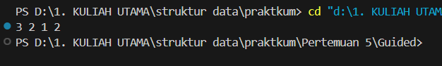

# Laporan Praktikum Struktur Data

## 1. Nama, NIM, Kelas
- **Nama**: Fa'iq Jagadhita Hardiana
- **NIM**: 103112430015
- **Kelas**: 12-IF-05
## 2. Motivasi Belajar Struktur Data
tentunya karena harus lulus stuktur data biar lulus, dan mungkin agak semangat dikit belajar bahasa baru yaitu c++ ya walaupun susah di cerna di saya lebih tepatnya butuh waktu ibaratnya loading wakk bissmillah BISA BROKKK

## 3. Dasar Teori
Linked list adalah strukur data linier berbentuk rantai simpul di mana setiap simpul menyimpan 2 item, yaitu nilai data dan pointer ke simpul elemen berikutnya. Berbeda dengan array, elemen linked list tidak ditempatkan dalam alamat memori yang berdekatan melainkan elemen ditautkan menggunakan pointer.

- **Singly linked list**: adalah linked list unidirectional. Jadi, kita hanya dapat melintasinya dalam satu arah, yaitu dari simpul kepala ke simpul ekor.
- **Doubly linked list**:  adalah linked list bidirectional. Jadi, kita bisa melintasinya secara dua arah. Tidak seperti singly linked list, simpul doubly linked list berisi satu pointer tambahan yang disebut previous pointer. Pointer ini menunjuk ke simpul sebelumnya.

## 4. Guided
### 4.1 Guided 

```cpp
#include <iostream>
using namespace std;
#define Nil NULL

typedef int infotype;
typedef struct elmlist *address;

struct elmlist {
    infotype info;
    address next;
    address prev;
};

struct List {
    address first;
    address last;
};

address alokasi(infotype x) {
    address P = new elmlist;
    P->info = x ; P->next = Nil; P->prev = Nil; return P;
}
void dealokasi(address &P) {delete P; P = Nil;}
void insertFirst(List &L, address P) {
    P->next = L.first; P->prev = Nil;
    if (L.first != Nil) L.first->prev = P; else L.last = P;
    L.first = P;
}

void printInfo(List L) {
    address P = L.first; while (P != Nil) {cout << P->info << " "; P = P-> next;} cout;
}
void deleteFirst(List &L, address &P) {
    P = L.first; L.first = L.first->next;
    if (L.first != Nil) L.first->prev = Nil; else L.last = Nil;
    P->next = Nil; P->prev = Nil;
}

void deleteLast (List &L, address &P) {
    P = L.last; L.last = L.last->prev;
    if (L.last != Nil) L.last->next = Nil; else L.first = Nil;
    P->prev = Nil; P->next = Nil;
}

void deleteAfter (List &L, address &P, address R) {
    P = R->next; R->next = P->next;
    if (P->next != Nil) P->next->prev = R; else L.last = R;
    P->prev = Nil; P->next = Nil;
}

int main() {
    List L; L.first = Nil; L.last = Nil;
    insertFirst(L, alokasi (1)); insertFirst(L, alokasi(2)); insertFirst (L, alokasi(3));
    printInfo(L);
    address P; deleteFirst(L, P); dealokasi (P);
    deleteAfter (L, P, L.first); dealokasi (P);
    printInfo(L);
    return 0;
}
```

Output:



Penjelasan : 

Struktur elmlist berfungsi untuk menyimpan data serta dua pointer, yaitu next yang menunjuk ke elemen berikutnya dan prev yang menunjuk ke elemen sebelumnya. Sementara itu, struktur List menyimpan alamat dari elemen pertama (first) dan elemen terakhir (last) dalam daftar. Fungsi alokasi() digunakan untuk membuat node baru, sedangkan dealokasi() berperan menghapus node tersebut dari memori. Prosedur insertFirst() menambahkan elemen di bagian awal list, dan printInfo() digunakan untuk menampilkan seluruh data yang ada dalam list. Adapun fungsi deleteFirst(), deleteLast(), dan deleteAfter() masing-masing digunakan untuk menghapus elemen pertama, elemen terakhir, atau elemen yang berada setelah node tertentu. Dalam fungsi main(), tiga elemen — yaitu 1, 2, dan 3 — dimasukkan secara berurutan ke bagian awal list, menghasilkan susunan akhir 3 → 2 → 1. Setelah beberapa proses penghapusan dilakukan, program menampilkan elemen-elemen yang tersisa di dalam list. Secara keseluruhan, program ini mendemonstrasikan mekanisme dasar dalam menambah dan menghapus data pada double linked list, di mana setiap node memiliki keterkaitan dua arah, memungkinkan traversal maju dan mundur secara efisien.
### 4.2 Guided 2

```cpp
#include <iostream>
#define Nil NULL
using namespace std;

typedef int infotype;
typedef struct elmlist *address;


struct elmlist{
    infotype info;
    address next;
    address prev;
};


struct List {
    address first;
    address last;
};


void insertFirst(List &L, address P) {
    P->next = L.first;
    P->prev = Nil;
    if (L.first != Nil) L.first->prev = P;
    else L.last = P ;
    L.first = P;
}


void insertLast(List &L, address P) {
    P->prev = L.last;
    P->next = Nil;
    if (L.last != Nil) L.last -> next = P;
    else L.first = P;
    L.last = P;
}


void insertAfter (List &L, address P, address R) {
    P->next = R->next;
    P->prev = R;
    if (R->next != Nil) R->next->prev = P;
    else L.last = P;
    R->next = P;
}


address alokasi(infotype x) {
    address P = new elmlist;
    P->info = x;
    P->next = Nil;
    P->prev = Nil;
    return P;
}


void printInfo(List L) {
    address P = L.first;
    while (P != Nil) {
        cout << P->info << " ";
        P = P-> next ;
    }
    cout << endl;
}


int main(){
    List L;
    L.first = Nil;
    L.last = Nil;
    address P1 = alokasi(1);
    insertFirst(L, P1);
    address P2 = alokasi(2);
    insertLast(L, P2);
    address P3 = alokasi(3);
    insertAfter(L, P3, P1);
    printInfo(L);
    return 0;
}
```

Output:


Penjelasan :

Struktur elmlist merepresentasikan satu simpul (node) yang menyimpan data (info) serta dua pointer, yaitu next untuk menunjuk ke node berikutnya dan prev untuk menunjuk ke node sebelumnya. Sementara itu, struktur List berfungsi menyimpan alamat node pertama (first) dan node terakhir (last) dalam daftar. Fungsi alokasi() digunakan untuk membuat node baru yang berisi nilai tertentu. Prosedur insertFirst() menambahkan node di awal daftar, insertLast() menempatkan node di bagian akhir, sedangkan insertAfter() menyisipkan node setelah elemen tertentu. Setiap fungsi memastikan pointer next dan prev selalu terhubung secara konsisten agar hubungan dua arah antar node tetap terjaga. Dalam fungsi main(), list L awalnya dikosongkan, kemudian tiga node baru dibuat dengan nilai 1, 2, dan 3. Node dengan nilai 1 dimasukkan di awal list, node bernilai 2 ditambahkan di akhir, dan node bernilai 3 disisipkan setelah node pertama. Hasil akhirnya ditampilkan melalui fungsi printInfo(), yang mencetak urutan elemen menjadi 1 3 2, menunjukkan struktur list setelah seluruh proses penyisipan selesai.

## 5. Unguided
### 5.1 Unguided 1

```cpp
#include <iostream>

#define Nil NULL

using namespace std;

typedef int infotype;
typedef struct elmlist *address;

struct elmlist {
    infotype info;
    address next;
    address prev;
};

struct List {
    address first;
    address last;
};

void insertFirst(List &L, address P) {
    P->next = L.first;
    P->prev = Nil;
    if (L.first != Nil) L.first->prev = P;
    else L.last = P;
    L.first = P;
}

void insertLast(List &L, address P) {
    P->prev = L.last;
    P->next = Nil;
    if (L.last != Nil) L.last->next = P;
    else L.first = P;
    L.last = P;
}

void insertAfter(List &L, address P, address R) {
    P->next = R->next;
    P->prev = R;
    if (R->next != Nil) R->next->prev = P;
    else L.last = P;
    R->next = P;
}

address alokasi(infotype x) {
    address P = new elmlist;
    P->info = x;
    P->next = Nil;
    P->prev = Nil;
    return P;
}

void printInfo(List L) {
    address P = L.first;
    while (P != Nil) {
        cout << P->info << " ";
        P = P->next;
    }
    cout << endl;
}

void insertBefore(List &L, address P, address R) {
    P->next = R;
    P->prev = R->prev;
    if (R->prev != Nil)
        R->prev->next = P;
    else
        L.first = P;
    R->prev = P;
}

void printReverse(List L) {
    address P = L.last;
    while (P != Nil) {
        cout << P->info << " ";
        P = P->prev;
    }
    cout << endl;
}

int main() {
    List L;
    L.first = Nil;
    L.last = Nil;

    cout << "TASK 1: INSERT OPERATIONS" << endl;

    // Membuat list awal: 1 3 2
    address P1 = alokasi(1);
    insertFirst(L, P1);
    address P2 = alokasi(2);
    insertLast(L, P2);
    address P3 = alokasi(3);
    insertAfter(L, P3, P1);

    cout << "List awal:" << endl;
    cout << "Forward: ";
    printInfo(L);
    cout << "Backward: ";
    printReverse(L);

    // InsertBefore: 4 sebelum 2
    address P4 = alokasi(4);
    insertBefore(L, P4, P2);
    cout << "Berhasil insert 4 sebelum 2" << endl;

    // InsertBefore: 5 sebelum 1
    address P5 = alokasi(5);
    insertBefore(L, P5, P1);
    cout << "Berhasil insert 5 sebelum 1" << endl;

    cout << "List setelah insertBefore:" << endl;
    cout << "Forward: ";
    printInfo(L);
    cout << "Backward: ";
    printReverse(L);

    return 0;
}

```

Output :


Penjelasan :

Struktur elmlist berfungsi untuk menyimpan data serta dua pointer yang saling menghubungkan antar elemen, sedangkan List berperan sebagai penampung pointer yang menunjuk ke elemen pertama (first) dan terakhir (last). Program ini mengimplementasikan beberapa operasi dasar, antara lain insertFirst untuk menambah data di awal, insertLast untuk menambah di akhir, insertAfter untuk menyisipkan elemen setelah node tertentu, dan insertBefore untuk menyisipkan sebelum node tertentu. Pada fungsi main(), program memulai dengan membuat list kosong, kemudian menambahkan beberapa elemen hingga membentuk urutan 1, 3, dan 2. Selanjutnya, elemen 4 disisipkan sebelum 2, dan elemen 5 disisipkan sebelum 1, sehingga urutan akhir menjadi 5, 1, 3, 4, 2. Program kemudian menampilkan isi list dari arah depan maupun belakang untuk memastikan setiap node terhubung dengan benar. Secara keseluruhan, program ini mendemonstrasikan prinsip dasar double linked list, yaitu bagaimana struktur data dapat menyimpan dan mengelola elemen secara dua arah melalui hubungan antar node yang saling terhubung.

### 5.2 Unguided 2

```cpp
#include <iostream>
using namespace std;
#define Nil NULL

typedef int infotype;
typedef struct elmlist *address;

struct elmlist {
    infotype info;
    address next;
    address prev;
};

struct List {
    address first;
    address last;
};

address alokasi(infotype x) {
    address P = new elmlist;
    P->info = x;
    P->next = Nil;
    P->prev = Nil;
    return P;
}

void dealokasi(address &P) {
    delete P;
    P = Nil;
}

void insertFirst(List &L, address P) {
    P->next = L.first;
    P->prev = Nil;
    if (L.first != Nil)
        L.first->prev = P;
    else
        L.last = P;
    L.first = P;
}

void printInfo(List L) {
    address P = L.first;
    while (P != Nil) {
        cout << P->info << " ";
        P = P->next;
    }
    cout << endl;
}

void deleteFirst(List &L, address &P) {
    P = L.first; L.first = L.first->next;
    if (L.first != Nil) L.first->prev = Nil; else L.last = Nil;
    P->next = Nil; P->prev = Nil;
}

void deleteLast (List &L, address &P) {
    P = L.last; L.last = L.last->prev;
    if (L.last != Nil) L.last->next = Nil; else L.first = Nil;
    P->prev = Nil; P->next = Nil;
}

void deleteAfter (List &L, address &P, address R) {
    P = R->next; R->next = P->next;
    if (P->next != Nil) P->next->prev = R; else L.last = R;
    P->prev = Nil; P->next = Nil;
}

bool deleteByValue(List &L, infotype x) {
    address P = L.first;

    while (P != Nil && P->info != x) {
        P = P->next;
    }

    if (P == Nil) {
        cout << "Nilai " << x << " tidak ditemukan" << endl;
        return false;
    }

    if (P == L.first) {
        L.first = P->next;
        if (L.first != Nil)
            L.first->prev = Nil;
        else
            L.last = Nil;
    } else if (P == L.last) {
        L.last = P->prev;
        if (L.last != Nil)
            L.last->next = Nil;
        else
            L.first = Nil;
    } else {
        P->prev->next = P->next;
        P->next->prev = P->prev;
    }

    cout << "Nilai " << x << " berhasil dihapus" << endl;
    dealokasi(P);
    return true;
}

void deleteAll(List &L) {
    address P = L.first;
    int count = 0;
    while (P != Nil) {
        address temp = P;
        P = P->next;
        dealokasi(temp);
        count++;
    }
    L.first = Nil;
    L.last = Nil;
    cout << "Semua elemen (" << count << ") berhasil dihapus" << endl;
}

int main() {
    List L;
    L.first = Nil;
    L.last = Nil;

    cout << "TASK 1: DELETE OPERATIONS" << endl;

    // List awal: 2 3 2 1
    insertFirst(L, alokasi(1));
    insertFirst(L, alokasi(2));
    insertFirst(L, alokasi(3));
    insertFirst(L, alokasi(2));

    cout << "List awal: ";
    printInfo(L);

    // Delete by value 2
    deleteByValue(L, 2);
    cout << "Setelah deleteByValue(2): ";
    printInfo(L);

    // Delete value yang tidak ada
    deleteByValue(L, 5);
    cout << "List tetap: ";
    printInfo(L);

    // Tambah data baru
    insertFirst(L, alokasi(5));
    cout << "List setelah tambah data: ";
    printInfo(L);

    // Delete semua elemen
    deleteAll(L);

    return 0;
}
```

Output:


Penjelasan :

Program ini memanfaatkan beberapa fungsi utama untuk mengelola struktur data linked list. Fungsi alokasi() berperan dalam membuat node baru, sedangkan dealokasi() digunakan untuk menghapus node dari memori. Prosedur insertFirst() menambahkan elemen di bagian awal list, dan printInfo() berfungsi menampilkan seluruh isi list. Untuk proses penghapusan data, terdapat beberapa prosedur: deleteFirst() menghapus elemen pertama, deleteLast() menghapus elemen terakhir, dan deleteAfter() menghapus elemen yang terletak setelah node tertentu. Selain itu, deleteByValue() digunakan untuk mencari dan menghapus elemen berdasarkan nilai yang diberikan, sedangkan deleteAll() berfungsi menghapus seluruh elemen list sekaligus. Dalam fungsi main(), program membuat list yang berisi data 2, 3, 2, dan 1. Selanjutnya, program menghapus elemen bernilai “2”, mencoba menghapus nilai yang tidak terdapat dalam list (yaitu 5), menambahkan beberapa data baru, dan pada tahap akhir, menghapus seluruh elemen yang tersisa dalam list.
### 5.3 Unguided 3

```cpp
#include <iostream>
using namespace std;
#define Nil NULL

typedef int infotype;
typedef struct elmlist *address;

struct elmlist {
    infotype info;
    address next;
    address prev;
};

struct List {
    address first;
    address last;
};

address alokasi(infotype x) {
    address P = new elmlist;
    P->info = x;
    P->next = Nil;
    P->prev = Nil;
    return P;
}

void dealokasi(address &P) {
    delete P;
    P = Nil;
}

void insertFirst(List &L, address P) {
    P->next = L.first;
    P->prev = Nil;
    if (L.first != Nil)
        L.first->prev = P;
    else
        L.last = P;
    L.first = P;
}

void insertLast(List &L, address P) {
    P->prev = L.last;
    P->next = Nil;
    if (L.last != Nil)
        L.last->next = P;
    else
        L.first = P;
    L.last = P;
}

void insertAfter(List &L, address P, address R) {
    P->next = R->next;
    P->prev = R;
    if (R->next != Nil)
        R->next->prev = P;
    else
        L.last = P;
    R->next = P;
}

void printForward(List L) {
    address P = L.first;
    while (P != Nil) {
        cout << P->info << " ";
        P = P->next;
    }
    cout << endl;
}

void printBackward(List L) {
    address P = L.last;
    while (P != Nil) {
        cout << P->info << " ";
        P = P->prev;
    }
    cout << endl;
}

// SMART INSERT
void smartInsert(List &L, infotype x) {
    address P = alokasi(x);
    cout << "Smart Insert: ";

    // 1) List kosong
    if (L.first == Nil) {
        insertFirst(L, P);
        cout << "List kosong, insert " << x << " di first" << endl;
        return;
    }

    // 2) Nilai lebih kecil dari elemen pertama
    if (x < L.first->info) {
        insertFirst(L, P);
        cout << x << " < first, insert di first" << endl;
        return;
    }

    // 3) Nilai genap
    if (x % 2 == 0) {
        insertLast(L, P);
        cout << x << " genap, insert di last" << endl;
        return;
    }

    // 4) Nilai ganjil (di antara dua nilai)
    address Q = L.first;
    bool inserted = false;
    while (Q->next != Nil) {
        if (Q->info < x && x < Q->next->info) {
            insertAfter(L, P, Q);
            cout << x << " di antara " << Q->info << " dan " << Q->next->info << endl;
            inserted = true;
            break;
        }
        Q = Q->next;
    }

    // Jika tidak menemukan posisi di tengah
    if (!inserted) {
        insertLast(L, P);
        cout << x << " insert di last (tidak menemukan posisi tengah)" << endl;
    }
}

// CONDITIONAL DELETE (hapus semua bilangan ganjil)
void conditionalDelete(List &L) {
    cout << "Sebelum Conditional Delete: ";
    printForward(L);

    address P = L.first;
    int count = 0;

    while (P != Nil) {
        address next = P->next;
        if (P->info % 2 != 0) { // hapus ganjil
            if (P == L.first) {
                L.first = P->next;
                if (L.first != Nil) L.first->prev = Nil;
                else L.last = Nil;
            } else if (P == L.last) {
                L.last = P->prev;
                if (L.last != Nil) L.last->next = Nil;
                else L.first = Nil;
            } else {
                P->prev->next = P->next;
                P->next->prev = P->prev;
            }
            dealokasi(P);
            count++;
        }
        P = next;
    }

    cout << "Conditional Delete: " << count << " elemen ganjil dihapus" << endl;
    cout << "Setelah Conditional Delete: ";
    printForward(L);
}

// MAIN PROGRAM
int main() {
    List L;
    L.first = Nil;
    L.last = Nil;

    cout << "ADVANCED OPERATIONS" << endl;
    cout << "SMART INSERT DEMO" << endl;

    smartInsert(L, 5);
    smartInsert(L, 3);
    smartInsert(L, 8);
    smartInsert(L, 6);
    smartInsert(L, 4);
    smartInsert(L, 7);

    cout << "\nHasil Smart Insert:" << endl;
    cout << "Forward: ";
    printForward(L);
    cout << "Backward: ";
    printBackward(L);
    cout << endl;

    cout << "CONDITIONAL DELETE" << endl;
    conditionalDelete(L);
    cout << endl;

    cout << "DELETE BY VALUE DEMO" << endl;
    // hapus nilai 6
    int x = 6;
    address P = L.first;
    while (P != Nil && P->info != x) P = P->next;
    if (P != Nil) {
        if (P == L.first) {
            L.first = P->next;
            if (L.first != Nil) L.first->prev = Nil;
        } else if (P == L.last) {
            L.last = P->prev;
            if (L.last != Nil) L.last->next = Nil;
        } else {
            P->prev->next = P->next;
            P->next->prev = P->prev;
        }
        cout << "Nilai " << x << " berhasil dihapus" << endl;
        dealokasi(P);
    } else {
        cout << "Nilai " << x << " tidak ditemukan" << endl;
    }

    // hapus nilai 10
    x = 10;
    P = L.first;
    while (P != Nil && P->info != x) P = P->next;
    if (P != Nil) {
        if (P == L.first) {
            L.first = P->next;
            if (L.first != Nil) L.first->prev = Nil;
        } else if (P == L.last) {
            L.last = P->prev;
            if (L.last != Nil) L.last->next = Nil;
        } else {
            P->prev->next = P->next;
            P->next->prev = P->prev;
        }
        cout << "Nilai " << x << " berhasil dihapus" << endl;
        dealokasi(P);
    } else {
        cout << "Nilai " << x << " tidak ditemukan" << endl;
    }

    cout << "List akhir: ";
    printForward(L);
    cout << endl;

    cout << "DELETE ALL DEMO" << endl;
    int count = 0;
    while (L.first != Nil) {
        address temp = L.first;
        L.first = L.first->next;
        dealokasi(temp);
        count++;
    }
    L.last = Nil;
    cout << "Semua elemen (" << count << ") berhasil dihapus" << endl;

    return 0;
}
```

Output:


Penjelasan :

Program ini memiliki dua fitur utama, yaitu Smart Insert dan Conditional Delete.
Fitur Smart Insert berfungsi menambahkan elemen ke dalam list dengan mengikuti aturan tertentu: apabila list masih kosong atau data baru lebih kecil dari elemen pertama, maka data akan disisipkan di awal. Jika data bernilai genap, elemen ditempatkan di akhir list, sedangkan data ganjil disisipkan pada posisi tertentu berdasarkan nilai sebelumnya. Sementara itu, Conditional Delete berperan untuk menghapus seluruh elemen bernilai ganjil serta elemen tertentu yang dicari oleh pengguna. Setelah setiap proses penyisipan maupun penghapusan, program secara otomatis menampilkan isi list dari arah depan dan belakang. Secara keseluruhan, program ini menggambarkan mekanisme kerja Double Linked List dengan penerapan logika penyisipan dan penghapusan yang bersifat dinamis serta berbasis kondisi.

## 6. Kesimpulan
Double Linked List adalah struktur data dinamis yang setiap elemennya memiliki dua pointer, yaitu ke elemen sebelumnya (prev) dan selanjutnya (next). Dengan dua arah ini, proses penelusuran, penyisipan, dan penghapusan data menjadi lebih fleksibel dibanding Single Linked List.
## 7. Referensi
1. https://www.trivusi.web.id/2022/07/struktur-data-linked-list.html
