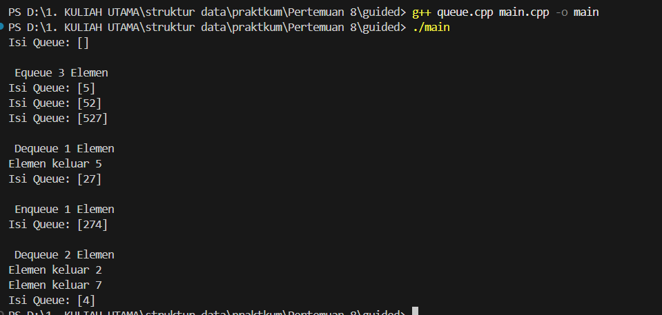
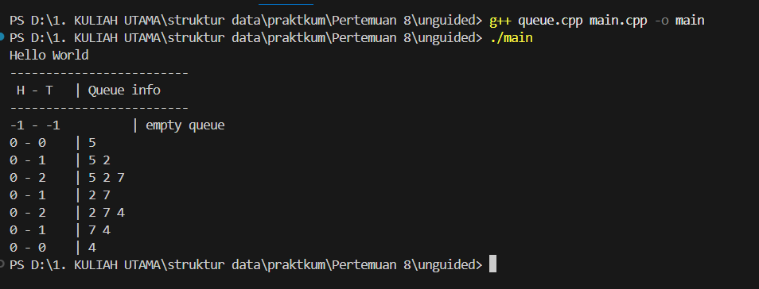

# Template Laporan Praktikum Struktur Data

## 1. Nama, NIM, Kelas
- **Nama**: Fa'iq Jagadhita Hardiana
- **NIM**: 103112430015
- **Kelas**: 12-IF-05

## 2. Motivasi Belajar Struktur Data
tentunya karena harus lulus stuktur data biar lulus, dan mungkin agak semangat dikit belajar bahasa baru yaitu c++ ya walaupun susah di cerna di saya lebih tepatnya butuh waktu ibaratnya loading wakk bissmillah BISA BROKKK

## 3. Dasar Teori
Queue atau dalam bahasa Indonesia yang berarti antrian adalah struktur data yang menyusun elemen-elemen data dalam urutan linier. Prinsip dasar dari struktur data ini adalah “First In, First Out” (FIFO) yang berarti elemen data yang pertama dimasukkan ke dalam antrean akan menjadi yang pertama pula untuk dikeluarkan.

## 4. Guided

### 4.1 Guided 1

```cpp
#ifndef QUEUE_H
#define QUEUE_H

#define MAX_QUEUE 5

struct Queue {
    int info[MAX_QUEUE];
    int head;
    int tail;
    int count;
};

void createQueue(Queue &Q);

bool isEmpty(Queue Q);

bool isFull(Queue Q);

void enqueue(Queue &Q, int x);

int dequeue(Queue &Q);

void printInfo(Queue Q);

#endif

```

Penjelasan :

File queue.h berfungsi sebagai header yang mendefinisikan struktur queue serta prototipe fungsi yang digunakan dalam implementasinya. Konstanta MAX_QUEUE menentukan kapasitas maksimum antrian, yaitu 5 elemen. Struktur Queue berisi array info sebagai penyimpan data, serta tiga parameter penting: head sebagai penunjuk elemen terdepan, tail sebagai penunjuk posisi penambahan elemen berikutnya, dan count untuk melacak jumlah elemen yang sedang berada dalam antrian. File ini juga mencantumkan deklarasi fungsi seperti createQueue, isEmpty, isFull, enqueue, dequeue, dan printInfo, sehingga file lain dapat menggunakan fungsi-fungsi tersebut tanpa mengetahui detail implementasinya. Dengan demikian, file ini berperan sebagai blueprint dari seluruh operasi queue.

### 4.2 Guided 2

```cpp
#include "queue.h"
#include <iostream>

using namespace std;

void createQueue(Queue &Q) {
    Q.head = 0;
    Q.tail = 0;
    Q.count = 0;
}

bool isEmpty(Queue Q) {
    return Q.count == 0; 
}

bool isFull(Queue Q) {
    return Q.count == MAX_QUEUE; 
}

void enqueue(Queue &Q, int x) {
    if (!isFull(Q)) {
        Q.info[Q.tail] = x;

        Q.tail = (Q.tail + 1 ) % MAX_QUEUE; 
        Q.count++;
    } else {
        cout << "Antrian Penuh!" << endl;
    }
}

int dequeue (Queue & Q){
    if (!isEmpty(Q)) {
        int X = Q.info[Q.head];
        Q.head = (Q.head + 1) % MAX_QUEUE;
        Q.count--;
        return X;
    } else {
        cout << "Antrian Kosong!" << endl;
        return -1; 
    }
}

void printInfo(Queue Q) {
    cout << "Isi Queue: [";
    if (!isEmpty(Q)) {
        int i = Q.head;
        int n = 0;
        while (n < Q.count) {
            cout << Q.info[i] << "";
            i = (i + 1) % MAX_QUEUE;
            n++;
        }
    }
    cout << "]" << endl;
}
```

Penjelasan :

File queue.cpp memuat implementasi lengkap dari seluruh fungsi queue yang telah dideklarasikan pada queue.h. Fungsi createQueue menginisialisasi struktur queue dengan menetapkan head, tail, dan count ke nilai 0. Fungsi isEmpty dan isFull digunakan untuk mengecek kondisi antrian berdasarkan nilai count. Operasi enqueue menambahkan data pada indeks tail, kemudian memajukan posisi tail secara circular dengan operasi (tail + 1) % MAX_QUEUE. Sebaliknya, dequeue mengambil elemen dari indeks head dan memindahkan head ke indeks berikutnya dengan pola yang sama. Setiap penambahan elemen meningkatkan count, sementara pengeluaran elemen menguranginya. Fungsi printInfo kemudian menampilkan isi antrian mulai dari indeks head sebanyak jumlah elemen yang ada, juga dengan pergerakan circular. File ini menjadi pusat implementasi dari logika queue.

### 4.3 Guided 3

```cpp
#include <iostream>
#include "queue.h"

using namespace std;

int main() {
    Queue Q;

    createQueue(Q);
    printInfo(Q);

    cout << "\n Equeue 3 Elemen  " << endl;
    enqueue(Q, 5);
    printInfo(Q);
    enqueue(Q, 2);
    printInfo(Q);
    enqueue(Q, 7);
    printInfo(Q);

    cout << "\n Dequeue 1 Elemen " << endl;
    cout << "Elemen keluar " << dequeue(Q) << endl;
    printInfo(Q);

    cout << "\n Enqueue 1 Elemen " << endl;
    enqueue(Q, 4);
    printInfo(Q);

    cout << "\n Dequeue 2 Elemen " << endl;
    cout << "Elemen keluar " << dequeue(Q) << endl;
    cout << "Elemen keluar " << dequeue(Q) << endl;
    printInfo(Q);

    return 0;
}
```

Penjelasan :

File main.cpp berperan sebagai program utama yang mengatur seluruh proses pada struktur data antrian. Di dalamnya dibuat objek Queue Q, kemudian fungsi createQueue(Q) dipanggil untuk menyiapkan antrian sebelum digunakan. File ini menampilkan contoh penggunaan operasi dasar queue, seperti enqueue untuk menambahkan elemen dan dequeue untuk mengeluarkan elemen, sekaligus memperlihatkan perubahan isi antrian melalui pemanggilan printInfo(Q) setiap kali operasi dilakukan. Program memasukkan nilai 5, 2, dan 7, mengeluarkan beberapa elemen, lalu menambahkan elemen 4, sebelum kembali melakukan operasi dequeue. Secara keseluruhan, file ini berfungsi sebagai driver yang memperagakan cara kerja implementasi queue yang ditulis di file lain.

Output :



## 5. Unguided
### 5.1 Unguided 1

pertama ubahlah ADT dan main porgamnya sesuai dengan ketentuanya. baru ubah sesusai kebutuhan pada file queue.cpp

queue.h

```cpp
#ifndef QUEUE_H
#define QUEUE_H

#define MAX_QUEUE 5

typedef struct {
    int info[MAX_QUEUE];
    int head;
    int tail;
} Queue;

void CreateQueue(Queue &Q);
bool isEmptyQueue(Queue Q);
bool isFullQueue(Queue Q);
void enqueue(Queue &Q, int x);
int dequeue(Queue &Q);
void printInfo(Queue Q);

#endif

```

queue.cpp

```cpp
#include <iostream>
#include "queue.h"
using namespace std;

void CreateQueue(Queue &Q) {
    Q.head = -1;
    Q.tail = -1;
}

bool isEmptyQueue(Queue Q) {
    return (Q.head == -1 && Q.tail == -1);
}

bool isFullQueue(Queue Q) {
    return (Q.tail == MAX_QUEUE - 1);
}

void enqueue(Queue &Q, int x) {
    if (isFullQueue(Q)) {
        cout << "Queue penuh!" << endl;
    } else {
        if (isEmptyQueue(Q)) {
            Q.head = 0;
            Q.tail = 0;
        } else {
            Q.tail++;
        }
        Q.info[Q.tail] = x;
    }
}

int dequeue(Queue &Q) {
    if (isEmptyQueue(Q)) {
        cout << "Queue kosong!" << endl;
        return -1;
    }

    int temp = Q.info[Q.head];

    if (Q.head == Q.tail) {
        // hanya satu data
        Q.head = -1;
        Q.tail = -1;
    } else {
        // geser semua elemen ke kiri
        for (int i = Q.head; i < Q.tail; i++) {
            Q.info[i] = Q.info[i + 1];
        }
        Q.tail--;   // TAIL MUNDUR!
    }

    return temp;
}


void printInfo(Queue Q) {
    cout << Q.head << " - " << Q.tail << " \t | ";

    if (isEmptyQueue(Q)) {
        cout << "empty queue" << endl;
        return;
    }

    for (int i = Q.head; i <= Q.tail; i++) {
        cout << Q.info[i] << " ";
    }
    cout << endl;
}


```

main.cpp

```cpp
#include <iostream>
#include "queue.h"
using namespace std;

int main() {
    cout << "Hello World" << endl;

    Queue Q;
    CreateQueue(Q);

    cout << "-------------------------" << endl;
    cout << " H - T \t | Queue info" << endl;
    cout << "-------------------------" << endl;

    printInfo(Q);

    enqueue(Q, 5);  printInfo(Q);
    enqueue(Q, 2);  printInfo(Q);
    enqueue(Q, 7);  printInfo(Q);
    dequeue(Q);     printInfo(Q);
    enqueue(Q, 4);  printInfo(Q);
    dequeue(Q);     printInfo(Q);
    dequeue(Q);     printInfo(Q);

    return 0;
}

```

Output : 



Penjelasan :

Pada Alternatif 1, program queue dirancang dengan mempertahankan posisi head secara permanen di indeks 0. Ketika CreateQueue() dijalankan, nilai head dan tail diatur ke -1 sebagai tanda bahwa queue masih kosong. Saat operasi enqueue pertama dilakukan, head dan tail berubah menjadi 0, dan elemen baru langsung disimpan pada indeks tersebut. Enqueue berikutnya cukup menambah nilai tail satu posisi, sehingga data baru ditempatkan di indeks berikutnya.

Pada operasi dequeue, elemen pada indeks 0 selalu menjadi elemen yang diambil. Setelah itu, seluruh elemen yang tersisa digeser satu posisi ke kiri untuk menjaga agar elemen terdepan tetap berada di info[0]. Karena mekanisme shifting ini, nilai head tidak pernah berpindah dari indeks 0, sedangkan tail akan berkurang satu setiap kali proses geser selesai. Fungsi printInfo() menampilkan posisi head, tail, serta seluruh isi queue dari indeks 0 hingga tail. Pendekatan ini membuat struktur queue tampak rapi dan mudah dibaca, tetapi kurang efisien karena setiap dequeue memerlukan shifting yang memakan waktu.

### 5.2 Unguided 2

```cpp
#include <iostream>
#include "queue.h"
using namespace std;

void CreateQueue(Queue &Q) {
    Q.head = -1;
    Q.tail = -1;
}

bool isEmptyQueue(Queue Q) {
    return (Q.head == -1 && Q.tail == -1);
}

bool isFullQueue(Queue Q) {
    return (Q.tail == MAX_QUEUE - 1);
}

void enqueue(Queue &Q, int x) {
    if (isFullQueue(Q)) {
        cout << "Queue penuh!" << endl;
        return;
    }

    if (isEmptyQueue(Q)) {
        Q.head = 0;
        Q.tail = 0;
    } else {
        Q.tail++;
    }

    Q.info[Q.tail] = x;
}

int dequeue(Queue &Q) {
    if (isEmptyQueue(Q)) {
        cout << "Queue kosong!" << endl;
        return -1;
    }

    int temp = Q.info[Q.head];

    if (Q.head == Q.tail) {
        Q.head = -1;
        Q.tail = -1;
    } else {
        Q.head++;   // head bergerak ke kanan
    }

    return temp;
}

void printInfo(Queue Q) {
    cout << Q.head << " - " << Q.tail << " \t | ";

    if (isEmptyQueue(Q)) {
        cout << "empty queue" << endl;
        return;
    }

    for (int i = Q.head; i <= Q.tail; i++) {
        cout << Q.info[i] << " ";
    }
    cout << endl;
}

```

Penjelasan :

Alternatif 2 menggunakan pendekatan yang lebih efisien dengan menggerakkan head dan tail tanpa menggeser isi array. Ketika CreateQueue() dijalankan, head dan tail diinisialisasi ke -1. Pada enqueue pertama, keduanya berubah menjadi 0 dan elemen ditambahkan pada indeks tersebut. Enqueue berikutnya hanya meningkatkan tail, sehingga data baru ditempatkan di posisi tail terbaru.

Pada proses dequeue, nilai pada indeks head diambil dan head digeser ke indeks berikutnya tanpa melakukan shifting pada array. Pendekatan ini membuat elemen-elemen lama tetap berada pada posisi fisiknya, sehingga array dapat terlihat “berlubang” di bagian depan meskipun secara logis queue bekerja dengan benar. Queue dianggap kosong kembali ketika head melewati tail, dan pada titik itu keduanya direset menjadi -1. Fungsi printInfo() menampilkan elemen queue mulai dari head hingga tail. Alternatif ini jauh lebih efisien dibanding Alternatif 1 karena menghindari shifting, meskipun terdapat ruang array di depan yang tidak dapat digunakan ulang.

### 5.3 Unguided 3

```cpp
#include <iostream>
#include "queue.h"
using namespace std;

void CreateQueue(Queue &Q) {
    Q.head = -1;
    Q.tail = -1;
}

bool isEmptyQueue(Queue Q) {
    return (Q.head == -1);
}

bool isFullQueue(Queue Q) {
    return ((Q.head == 0 && Q.tail == MAX_QUEUE - 1) ||
           (Q.tail + 1) % MAX_QUEUE == Q.head);
}

void enqueue(Queue &Q, int x) {
    if (isFullQueue(Q)) {
        cout << "Queue penuh!" << endl;
        return;
    }

    if (isEmptyQueue(Q)) {
        Q.head = 0;
        Q.tail = 0;
    } else {
        Q.tail = (Q.tail + 1) % MAX_QUEUE;
    }

    Q.info[Q.tail] = x;
}

int dequeue(Queue &Q) {
    if (isEmptyQueue(Q)) {
        cout << "Queue kosong!" << endl;
        return -1;
    }

    int temp = Q.info[Q.head];

    if (Q.head == Q.tail) {
        Q.head = -1;
        Q.tail = -1;
    } else {
        Q.head = (Q.head + 1) % MAX_QUEUE;
    }

    return temp;
}

void printInfo(Queue Q) {
    cout << Q.head << " - " << Q.tail << " \t | ";

    if (isEmptyQueue(Q)) {
        cout << "empty queue" << endl;
        return;
    }

    int i = Q.head;
    while (true) {
        cout << Q.info[i] << " ";
        if (i == Q.tail) break;
        i = (i + 1) % MAX_QUEUE;
    }

    cout << endl;
}

```

Penjelasan :

Alternatif 3 menerapkan circular queue, yaitu mekanisme di mana head dan tail bergerak secara melingkar menggunakan operasi modulo. Pada tahap inisialisasi dengan CreateQueue(), head dan tail diset ke -1. Ketika enqueue dilakukan, tail dipindahkan ke (tail + 1) % MAX_QUEUE, memungkinkan tail kembali ke indeks awal ketika mencapai batas array. Jika queue kosong, head dan tail terlebih dahulu diatur ke 0.

Pada operasi dequeue, elemen pada indeks head dikembalikan, lalu head bergerak ke (head + 1) % MAX_QUEUE. Ketika setelah dequeue nilai head dan tail menjadi sama, queue dianggap kosong dan keduanya diset kembali ke -1. Kondisi penuh dideteksi melalui relasi circular antara head dan tail, bukan berdasarkan posisi linear. Fungsi printInfo() mencetak elemen queue dari head hingga tail menggunakan perulangan berbasis modulo. Pendekatan circular queue ini merupakan yang paling efisien karena tidak memerlukan shifting dan mampu memanfaatkan seluruh kapasitas array secara optimal.

## 6. Kesimpulan
Dari penerapan tiga alternatif pada struktur data queue, saya memahami bahwa satu konsep dapat diimplementasikan melalui berbagai pendekatan sesuai kebutuhan pengguna. Alternatif pertama menekankan prinsip dasar queue, meskipun kurang efisien karena memerlukan proses _shifting_ setiap kali terjadi penghapusan elemen. Alternatif kedua menawarkan kinerja yang lebih baik dengan menghilangkan proses _shifting_, namun ruang kosong yang muncul di bagian depan array tidak dapat digunakan kembali. Sementara itu, Alternatif ketiga menjadi pilihan paling efektif karena memanfaatkan mekanisme circular, sehingga seluruh kapasitas array dapat digunakan secara optimal. Melalui perbandingan ini, saya memperoleh gambaran yang lebih jelas mengenai perbedaan efisiensi, kelebihan, serta keterbatasan dari masing-masing metode implementasi queue.

## 7. Referensi
1. https://www.dicoding.com/blog/struktur-data-queue-pengertian-fungsi-dan-jenisnya/
