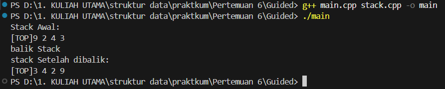
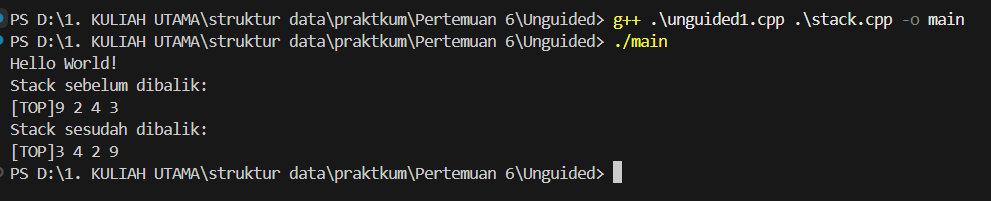
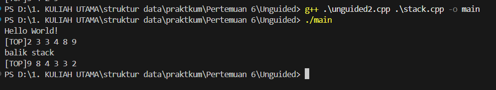
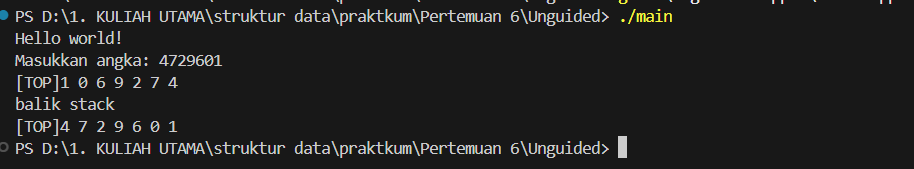

# Laporan Praktikum Struktur Data

## 1. Nama, NIM, Kelas
- **Nama**: Fa'iq Jagadhita Hardiana
- **NIM**: 103112430015
- **Kelas**: 12-IF-05

## 2. Motivasi Belajar Struktur Data
tentunya karena harus lulus stuktur data biar lulus, dan mungkin agak semangat dikit belajar bahasa baru yaitu c++ ya walaupun susah di cerna di saya lebih tepatnya butuh waktu ibaratnya loading wakk bissmillah BISA BROKKK

## 3. Dasar Teori
Secara sederhana, stack adalah **struktur data linier** yang digunakan untuk menyimpan sekumpulan objek atau variabel. Setiap penambahan data (push) dan penghapusan data (pop) terjadi di _ujung atas_ tumpukan. Sifat khas stack adalah **LIFO (Last In, First Out)**: data terakhir yang masuk akan menjadi data pertama yang keluar.

Karakteristik utama stack adalah aturan LIFO. Berikut operasi dasar yang biasa diterapkan pada stack:

- **Push:** Menambahkan elemen baru ke _bagian atas_ stack. Misalnya, menumpuk buku baru di atas tumpukan.
- **Pop:** Menghapus elemen di _puncak_ stack dan mengembalikan nilainya. Artinya, buku yang paling atas diambil keluar.
- **Peek/Top:** Melihat (mengintip) elemen teratas tanpa menghapusnya. Seperti mengintip buku paling atas tanpa mengambilnya.
- **IsEmpty:** Memeriksa apakah stack kosong atau tidak. Cocok seperti mengecek apakah masih ada piring di tumpukan.
- **Size:** Mengembalikan jumlah elemen dalam stack. Berguna untuk mengetahui seberapa tinggi tumpukan saat ini.

## 4. Guided
### 4.1 Guided 1

```cpp
#ifndef STACK_H
#define STACK_H 

#include <iostream>
#define MaxEl 20
#define Nil -1

typedef int infotype;

struct Stack {
    infotype info[MaxEl];
    int top;
};

void CreateStack(Stack &S) ;
bool isEmpty(Stack S) ;
bool isFull(Stack S) ;
void push(Stack &S, infotype X) ;
infotype pop(Stack &S) ;
void printInfo(Stack S) ;
void balikStack(Stack &S) ;

#endif

```

Penjelasan :

stack.h berfungsi sebagai header file yang mendefinisikan struktur dan fungsi yang akan digunakan untuk mengelola stack. Di dalamnya terdapat deklarasi tipe data Stack, yang menyimpan sebuah array bertipe integer dengan kapasitas maksimum 20 elemen serta variabel top yang menandai posisi elemen teratas. Selain itu, file ini juga mendeklarasikan beberapa fungsi seperti CreateStack, isEmpty, isFull, push, pop, printInfo, dan balikStack yang nantinya akan diimplementasikan di file lain. Dengan adanya file ini, program dapat memisahkan antara definisi struktur dan implementasi fungsinya agar lebih teratur dan mudah dipelihara.


### 4.2 Guided 2

```cpp
#include "stack.h"

using namespace std;

//fungsi membuat stack baru udengan menginisialisasi top = Nil
void CreateStack(Stack &S) {
    S.top = Nil;
}

//fungsi untuk mengecek apakah stack kosong
bool isEmpty(Stack S) {
    return S.top == Nil;
}

//fungsi untuk mengecek apakah stack penuh
bool isFull(Stack S) {
    return S.top == MaxEl - 1;
}

//fungsi untuk menambahkan elemen ke stack
void push(Stack &S, infotype x) {
    if (! isFull(S)) {
        S.top++;
        S.info[S.top] = x;
    } else {
        cout << "stack penuh!" << endl;
    }
}

// fungsi untuk mengambil elemen teratas dari stack (pop)
infotype pop (Stack &S) {
    infotype X = -999;
    if (!isEmpty(S)) {
        X = S.info[S.top];
        S.top--;
    } else {
        cout << "Stack Kosong!" << endl;
    }
    return X;
}

// fungsi untuk menampilkan isi stack
void printInfo(Stack S) {
    if (isEmpty(S)){
        cout << "Stack kosong" << endl;
    } else {
        cout << "[TOP]" ;
        for (int i = S.top; i >= 0; i--) {
            cout << S.info[i] << " ";
        }
        cout << endl;
    }
}

//fungsi untuk membalikan urutan elemen dalam stack
void balikStack(Stack &S) {
    if (!isEmpty(S)) {
        Stack temp1, temp2;
        CreateStack(temp1); CreateStack(temp2);

        while (!isEmpty(S)) {push (temp1, pop(S));}

        while (!isEmpty(temp1)) {push (temp2, pop(temp1));}

        while (!isEmpty(temp2)) {push (S, pop(temp2));}
    }
}
```

Penjelasan :

File stack.cpp merupakan tempat di mana seluruh fungsi yang telah dideklarasikan di header benar-benar diimplementasikan. Di dalamnya terdapat logika untuk membuat stack baru, menambah dan menghapus elemen, serta menampilkan isi stack ke layar. Fungsi CreateStack mengatur agar stack yang baru dibuat memiliki nilai top bernilai -1 sebagai tanda bahwa masih kosong. Fungsi isEmpty dan isFull digunakan untuk mengecek apakah stack sedang kosong atau penuh. Fungsi push menambahkan elemen ke bagian atas stack jika masih ada ruang, sedangkan pop mengambil elemen teratas dan mengurangi nilai top. Ada pula fungsi printInfo untuk menampilkan isi stack dari elemen paling atas hingga paling bawah, dan fungsi balikStack yang digunakan untuk membalik urutan elemen dalam stack dengan memanfaatkan dua stack sementara.


### 4.3 Guided 3

```cpp
#include "stack.h"
#include <iostream>

using namespace std ;

int main() {
    Stack S;
    CreateStack(S);

    push(S, 3);
    push(S, 4);
    push(S, 8);
    pop(S);
    push(S, 2);
    push(S, 3);
    pop(S);
    push(S, 9);

    cout << "Stack Awal:" << endl;
    printInfo(S);

    cout << "balik Stack" << endl;
    balikStack(S);

    cout << "stack Setelah dibalik:" << endl;
    printInfo(S);

    return 0;
}


```

Output:



Penjelasan :

file main.cpp adalah bagian utama yang menjalankan seluruh logika program. Pada file ini, dibuat sebuah stack baru bernama S dengan memanggil fungsi CreateStack. Program kemudian menambahkan beberapa angka ke dalam stack dengan perintah push dan menghapus beberapa elemen menggunakan pop, sehingga membentuk susunan angka tertentu. Setelah itu, isi stack awal ditampilkan di layar menggunakan printInfo. Program kemudian memanggil fungsi balikStack untuk membalik urutan elemen di dalam stack dan menampilkan hasil akhirnya setelah dibalik.

Ketika ketiga file tersebut digabung dan dijalankan, mereka membentuk sebuah program yang dapat mensimulasikan cara kerja struktur data stack secara lengkap. Program mampu menambah dan menghapus data sesuai prinsip LIFO (Last In, First Out), menampilkan isi stack sebelum dan sesudah dibalik, serta menunjukkan bagaimana elemen-elemen diatur di dalam memori. Dengan kata lain, hasil gabungan ketiganya menghasilkan program sederhana namun fungsional yang menggambarkan konsep dasar dari operasi stack dan manipulasi datanya.


## 5. Unguided

Sebelum masuk ke Unguided ada perubahan pada file stack.h dan stack.cpp
stack.h

```cpp
#ifndef STACK_H
#define STACK_H

#include <iostream>
#define MaxEl 20
#define Nil -1

typedef int infotype;

struct Stack{
    infotype info[MaxEl]; //array untuk menyimpan elemen stack
    int top;
};

void CreateStack(Stack &S);
bool isEmpty(Stack S);
bool isFull(Stack S);
void push(Stack &S, infotype x); // Menambahkan elemen ke dalam stack
infotype pop(Stack &S); // Mengambil elemen teratas dari stack
void printInfo(Stack S);
void balikStack(Stack &S); // Membalik urutan elemen dalam stack

// procedure tambahan
void pushAscending(Stack &S, infotype X);
void getInputStream(Stack &S);

#endif
```

Penjelasan : 
Ada 2 tambahan procedure yaitu void pushAscending dan void getInputStream

stack .cpp

```cpp
#include "stack.h" // mengimpor header file stack.h yang berisi definisi struktur dan konstanta

using namespace std;


void CreateStack(Stack &S){
    S.top = Nil;
}

// FUngsi untuk mengecek apakah stack kosong
bool isEmpty(Stack S){
    return S.top == Nil; // mengembalikan true jika top bernilai Nil, false jika tidak
}

// Fungsi untuk mengecek apakah stack penuh
bool isFull(Stack S){
    return S.top == MaxEl - 1;
}


void push(Stack &S, infotype x){
    if (!isFull(S)){
        S.top++;
        S.info[S.top] = x;
    }else{
        cout << "Stack Penuh!" << endl;
    }
}

// Fungsi untuk mengambil elemen teratas daristack (pop)
infotype pop(Stack &S){
    infotype x = -999;
    if (!isEmpty(S)){
        x = S.info[S.top];
        S.top--;
    } else{
        cout << "Stack Kosong!" << endl;
    }
    return x;
}

// FUngsi untuk menampilkan isi stack
void printInfo(Stack S) {
    if (isEmpty(S)) {
        cout << "Stack Kosong" << endl;
    } else {
        cout << "[TOP]";
        for (int i = S.top; i >= 0; i--) {
            cout << S.info[i] << " ";
        }
        cout << endl;
    }
}

// Fungsi untuk membalik urutan elemen dalam stack
void balikStack(Stack &S) {
    if (!isEmpty(S)) { // Cek apakah stack tidak kosong
        Stack temp1, temp2; // Deklarasi dua stack temporary
        CreateStack(temp1); CreateStack(temp2);

        while (!isEmpty(S)) { push(temp1, pop(S)); }

        while (!isEmpty(temp1)) { push(temp2, pop(temp1)); }

        while (!isEmpty(temp2)) { push(S, pop(temp2)); }
    }
}

// Menambahkan elemen secara ascending
void pushAscending(Stack &S, infotype X) {
    if (isFull(S)) {
        cout << "Stack penuh" << endl;
        return;
    }

    Stack temp;
    CreateStack(temp);

    // Pindahkan elemen yang lebih kecil dari X ke stack sementara
    while (!isEmpty(S) && S.info[S.top] < X) {
        push(temp, pop(S));
    }

    // Push X ke stack utama
    push(S, X);

    // Kembalikan elemen dari stack sementara ke stack utama
    while (!isEmpty(temp)) {
        push(S, pop(temp));
    }
}

// Membaca input stream dari user dan masukkan ke stack
void getInputStream(Stack &S) {
    cout << "Masukkan angka: ";
    string input;
    cin >> input; // membaca seluruh string angka tanpa spasi (misal: 4729601)

    for (char c : input) {
        if (isdigit(c)) { // hanya karakter angka yang valid
            int value = c - '0';
            push(S, value);
        }
    }
}
```

Penjelasan :

Ada 2 tambahan procedure yaitu void pushAscending dan void getInputStream
### 5.1 Unguided 1

```cpp
#include "stack.h"
#include <iostream>
using namespace std;

int main() {
    cout << "Hello World!" << endl;
    Stack S;
    CreateStack(S);

    // Operasi stack
    push(S, 3);
    push(S, 4);
    push(S, 8);
    pop(S);
    push(S, 2);
    push(S, 3);
    pop(S);
    push(S, 9);

    cout << "Stack sebelum dibalik:" << endl;
    printInfo(S);

    balikStack(S);

    cout << "Stack sesudah dibalik:" << endl;
    printInfo(S);

    return 0;
}
```

Output:



Penjelasan :

program ini cuma nambahin ouput hello word

### 5.2 Unguided 2

```cpp
#include "stack.h"
#include <iostream>
using namespace std;

int main() {
    cout << "Hello World!" << endl;
    Stack S;
    CreateStack(S);
    pushAscending(S, 3);
    pushAscending(S, 4);
    pushAscending(S, 8);
    pushAscending(S, 2);
    pushAscending(S, 3);
    pushAscending(S, 9);
    printInfo(S);
    cout << "balik stack" << endl;
    balikStack(S);
    printInfo(S);
    return 0;
}
```

Output:



Penjelasan :

Program Unguided2.cpp berfungsi sebagai program utama untuk menguji dua operasi penting pada struktur data stack, yaitu pushAscending dan balikStack. Setelah menyertakan file stack.h dan pustaka iostream, program membuat sebuah stack bernama S yang kemudian diinisialisasi menggunakan fungsi CreateStack(S). Selanjutnya, fungsi pushAscending diuji dengan memasukkan data secara berurutan: 3, 4, 8, 2, 3, dan 9. Berbeda dari fungsi push biasa, pushAscending memastikan setiap data yang dimasukkan tetap tersusun secara teratur, biasanya dari nilai terkecil ke terbesar. Setelah seluruh data dimasukkan, program memanggil printInfo(S) untuk menampilkan isi stack saat ini. Kemudian, program mencetak teks “balik stack” dan memanggil fungsi balikStack(S) untuk membalik urutan elemen di dalam stack. Hasil akhir setelah pembalikan ditampilkan kembali menggunakan printInfo(S). Melalui program ini, pengguna dapat memahami bagaimana stack tidak hanya mampu menyimpan data secara terurut, tetapi juga dapat memanipulasi urutannya dengan membalik posisi elemen secara sistematis.

### 5.3 Unguided 3

```cpp
#include "stack.h"
#include <iostream>
using namespace std;

int main() {
    cout << "Hello world!" << endl;
    Stack S;
    CreateStack(S);

    // gunakan fungsi getInputStream untuk membaca input angka dari user
    getInputStream(S);

    // tampilkan isi stack hasil input
    printInfo(S);

    cout << "balik stack" << endl;
    balikStack(S);

    // tampilkan hasil setelah dibalik
    printInfo(S);

    return 0;
}

```

Output:



Penjelasan :

Program tersebut digunakan untuk memperlihatkan cara kerja struktur data stack yang telah didefinisikan dalam file stack.h dan stack.cpp. Pada tahap awal, program membuat sebuah variabel stack bernama S dan menginisialisasinya dalam keadaan kosong menggunakan fungsi CreateStack(S). Selanjutnya, program memanggil fungsi getInputStream(S) untuk membaca serangkaian angka yang dimasukkan oleh pengguna, misalnya “4729601”. Setiap digit yang dimasukkan akan disimpan satu per satu ke dalam stack, dengan angka terakhir berada di posisi paling atas sesuai prinsip Last In, First Out (LIFO). Setelah proses input selesai, isi stack ditampilkan menggunakan fungsi printInfo(S) sehingga pengguna dapat melihat urutan angka dari elemen teratas hingga terbawah. Program kemudian memanggil fungsi balikStack(S) untuk membalik urutan elemen, membuat elemen yang sebelumnya berada di atas berpindah ke bagian bawah, dan sebaliknya. Hasil akhir setelah proses pembalikan ditampilkan kembali melalui printInfo(S) agar perubahan susunan elemen dapat terlihat dengan jelas.

## 6. Kesimpulan
Hasil percobaan ini tu tujuan utama kegiatan tersebut adalah memahami konsep dasar serta fleksibilitas struktur data Stack dalam pemrograman. Stack beroperasi dengan prinsip Last In First Out (LIFO), di mana elemen yang terakhir dimasukkan akan menjadi yang pertama dikeluarkan. Melalui penerapan fungsi-fungsi seperti push, pop, printInfo, dan balikStack, dapat diamati bagaimana proses penambahan, penghapusan, penampilan, dan pembalikan urutan data berlangsung di dalam stack. Selain itu, penambahan fungsi seperti pushAscending dan getInputStream memperlihatkan bahwa struktur ini dapat dikembangkan menjadi lebih adaptif; misalnya, pushAscending menjaga agar elemen selalu tersusun secara teratur, sedangkan getInputStream memberi kesempatan bagi pengguna untuk memasukkan data secara interaktif. Secara keseluruhan, pembelajaran mengenai stack tidak hanya menekankan pada teori dasar LIFO, tetapi juga pada penerapan dan pengembangannya untuk memenuhi kebutuhan logika serta perancangan algoritma dalam pemrograman modern.

## 7. Referensi
1. https://www.codepolitan.com/blog/apa-itu-stack-dalam-ilmu-pemrograman/
